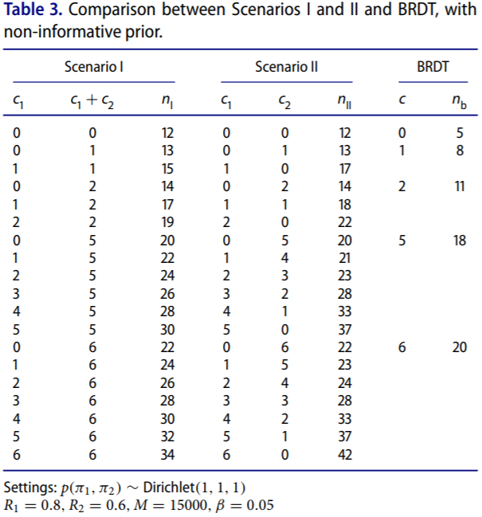

# Multi-stateRDT_QE2017
## About
### This is a demo to demonstrate the work of multi-state reliabiltiy demonstration test(RDT) designs, from one of the research projects listed in [Suiyao Chen's Homepage](https://sites.google.com/mail.usf.edu/suiyaochen-professional/publication?authuser=0). 
### The paper [Multi-state Reliability Demonstration Tests](https://www.researchgate.net/publication/315955046_Multi-State_Reliability_Demonstration_Tests) has been published in [Quality Engineering](https://www.tandfonline.com/eprint/6aSdzucbThJSnxZMZira/full). 

## Instructions
### The RDT design is based on Monte Carlo Simulation and each type of design has a different framework.
- **SRDT-binomial.R** is used for conventional binomial RDT (BRDT) design.
- **SRDT-multiperiods.R** is used for multi-state RDT design (Scenario I) with specifications over cumulative time periods.
- **SRDT-multiperiods(seperate).R** is used for multi-state RDT design (Scenario II) with specifications over seperate time periods.
- **SRDT-multimodes(binomial).R** is used for multi-state RDT design with specifications for multiple failure modes.
#### The comparison between several different designs is shown as below:

## [R Package](Rpackage)

